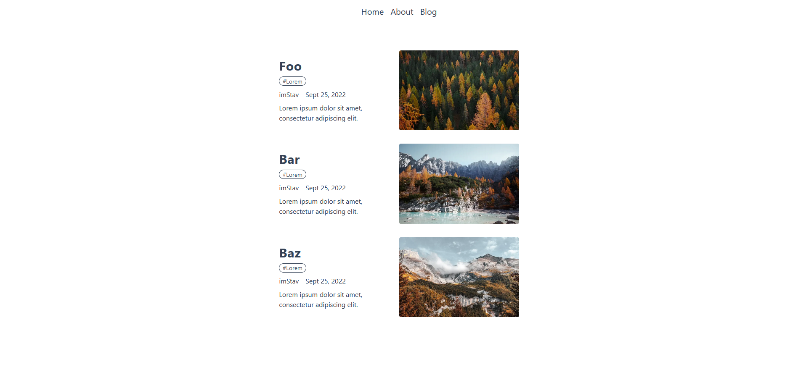

<picture>
  <source media="(prefers-color-scheme: dark)" srcset="assets/screenshots/blog-screenshot-dark.PNG">
  
</picture>

# Nuxt Content Blog

> A Nuxt Content blog template. Based on `Nuxt 3`, `Nuxt Content` module (v2), `Tailwind CSS` & `Tailwind Typography`

## Technologies

- ⛰️ Nuxt 3
- ⛰️ Nuxt Content 2
- 📝 Markdown
- 🌈 Tailwind CSS
- 🖋️ Tailwind Typography

*Find more information in the `package.json` file*

## Documentations

- 📚 Check out the Nuxt Content documentation for a better understanding here @ [content.nuxtjs.org](https://content.nuxtjs.org/)
- 🖋️ Find the Tailwind Typography documentation @ [tailwindcss.com/docs/typography-plugin](https://tailwindcss.com/docs/typography-plugin)
- 🛰️ For more information on deployment @ [v3.nuxtjs.org/docs/deployment](https://v3.nuxtjs.org/docs/deployment)